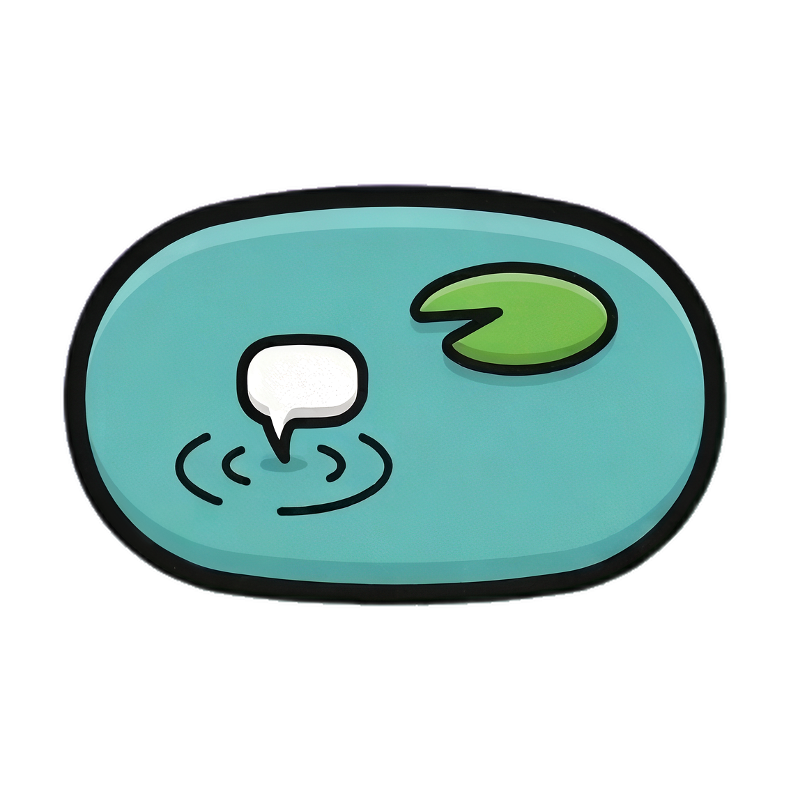
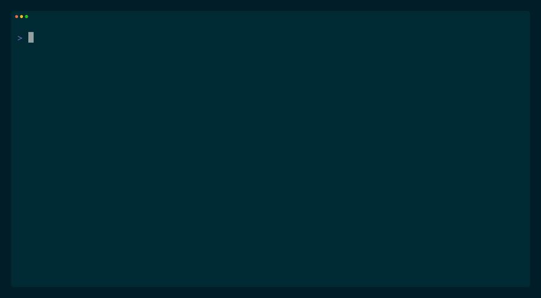
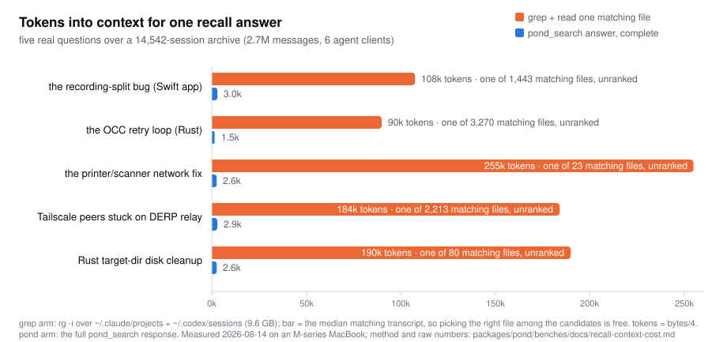

<p align="center">
  
</p>

# pond

[](https://github.com/tenequm/pond/actions/workflows/ci.yml)
[](https://crates.io/crates/pond-db)
[](https://pond.locker/)
[](LICENSE)

> "I know we discussed that before. Why can't I find that damn conversation?"

Pond makes every AI agent session you've ever run - Claude Code, Codex, any tool, any machine - searchable in one place.

Your agent history is already on your disk: thousands of sessions full of decisions, fixes, and dead ends - scattered across tools that can't search them. Pond ingests them all automatically and losslessly into storage you own (a local dir or your own S3 bucket), makes the whole corpus searchable and SQL-queryable, and hands that recall back to your agents over MCP - so "how did we fix this before?" is a query, not an archaeology dig. Sessions stop being locked to the tool that created them: any session can be restored into any supported client and continued there.

```sh
brew install tenequm/tap/pond
```

Or prompt your agent: *"Please install and set up pond (see github.com/tenequm/pond)."*

<p align="center">
  
</p>
<p align="center"><sub>A live 12k-session corpus, then a three-month-old fix found and verified against the current code (<a href="docs/site/assets/demo-search.mp4">crisper MP4</a>)</sub></p>

<p align="center">
  <picture>
    <source media="(prefers-color-scheme: dark)" srcset="docs/site/assets/tokens-chart-dark.svg">
    
  </picture>
</p>
<p align="center"><sub>Five real recall questions, one corpus, one machine - method, raw numbers, and a rerunnable script in <a href="docs/benchmarks/recall-context-cost.md">docs/benchmarks</a></sub></p>

Status: pre-v1. Schemas, wire shapes, and config keys are subject to breaking change until v1. Full documentation lives at [pond.locker](https://pond.locker/); the contract is [`docs/spec.md`](docs/spec.md).

## Quickstart

Install, run guided setup, and ingest your local sessions:

```sh
brew install tenequm/tap/pond
pond init   # guided setup: storage, adapters, MCP + agent skill, optional schedule
pond sync   # ingest, embed, update indexes - every enabled adapter
```

`pond init` registers pond as an MCP server for detected clients and installs the bundled pond skill for Claude Code (by hand: `claude mcp add -s user pond -- pond mcp`, `codex mcp add pond -- pond mcp`; skill: save `pond skill` output to `~/.claude/skills/pond/SKILL.md`). Then ask your agent - real prompts from daily use:

```
check in pond how we solved this before, then apply the same fix here
```
```
where we left off yesterday - check pond, then continue
```
```
are you sure that won't break X? check in pond how we struggled with exactly this
```

Sessions are picked up automatically from **Claude Code**, the **Claude desktop app** (local agent mode), **Codex CLI**, **opencode**, **pi-coding-agent**, **oh-my-pi**, **OpenClaw**, **NanoClaw**, and **Hermes Agent**. A Claude.ai data export imports with `pond sync claude-ai-export --path <path>` (manual download, so not auto-discovered).

## Isn't this another memory tool?

No - it's the layer underneath one. Memory tools store what they decided you'd need - facts, summaries, filed chunks; the sessions themselves are gone. Pond keeps the sessions: every message, tool call, and result, value-complete, cross-client, in storage you own, never pruned - searchable over MCP and restorable into any client. Memory is a derived view you can always rebuild from an archive; an archive can never be rebuilt from memories.

## Background

Every agentic CLI ships its own session format and its own search surface. Switching tools means losing history. Replaying a Claude Code session in another provider's tooling means re-translating the wire shape by hand. Hosted multi-tenant deployments rebuild the same storage layer from scratch.

Pond is the storage and retrieval layer that sits underneath. Every adapter is a bidirectional codec between a client format and one canonical schema, so any session can be restored by any adapter - it need not return to the client that produced it. Storage, search (vector or BM25 full-text, one arm per query), and provider-agnostic replay all sit on a single Lance-on-object-storage foundation.

The v1 surface includes: full CLI, HTTP+JSON and MCP transports, search over three Lance datasets, `intfloat/multilingual-e5-small` embeddings at FP16 weights (Metal on macOS, CUDA opt-in, CPU fallback), and local-FS / S3 / GCS / Azure backends through Lance's `object_store` integration.

## Install

Linux, macOS, and Windows are supported.

**Package Managers (macOS and Linux):**

```sh
brew install tenequm/tap/pond              # Homebrew
nix profile add github:tenequm/pond#pond   # Nix
cargo install pond-db                      # crates.io (installs the `pond` command)
```

**Build from source:**

```sh
git clone https://github.com/tenequm/pond.git
cd pond
cargo install --path packages/pond
```

For CUDA acceleration on Linux:

```sh
cargo install --path packages/pond --features cuda
```

On macOS the Metal backend is selected automatically; on other systems the CPU fallback runs without extra features.

On Windows, the Homebrew/Nix packages do not apply:

```powershell
winget install tenequm.pond

scoop bucket add tenequm https://github.com/tenequm/scoop-bucket
scoop install pond

cargo binstall pond-db
```

The winget manifest is in review at [winget-pkgs](https://github.com/microsoft/winget-pkgs), so `winget install` does not resolve yet - use Scoop until it merges. See the [Windows notes](https://pond.locker/get-started/install#windows) for building from source, Defender, long paths, and WSL.

## Usage

### Sync and search

Set up storage, adapters, MCP registration, and an optional sync schedule in one pass (idempotent - re-run it any time to repair or update):

```sh
pond init
```

Then import sessions from local adapters, embed them, update indexes, and search:

```sh
pond sync
pond search "how did we wire up the OCC retry loop"
```

### Run a server

```sh
pond serve                         # HTTP on 127.0.0.1:9797
pond serve --transport stdio       # MCP over stdio
pond mcp                           # alias for stdio MCP
```

### Fetch and copy

Fetch a single session or message, or move a whole corpus:

```sh
pond get-session <id>
pond get-message <id>
pond copy --from local --to snapshot.pond
pond copy --from snapshot.pond --to local
```

### Read-only SQL

Ask structured questions with read-only SQL (the same surface as the `pond_sql` MCP tool):

```sh
pond sql "SELECT project, count(*) FROM messages GROUP BY project ORDER BY 2 DESC"
```

### Maintenance

Run maintenance on demand (sync already embeds inline and folds indexes every run):

```sh
pond optimize --only embed
pond optimize --only index
```

### Scheduled sync

Keep pond current automatically (launchd on macOS, systemd user timers or cron on Linux, Task Scheduler on Windows):

```sh
pond schedule start                # every 5m by default (--every 15m|1h|6h|1d)
pond schedule status
pond schedule logs
```

### Status and introspection

`pond status` prints a per-table storage table, then `indexes` (text/semantic readiness), `stored` (sessions + messages), `agents` (source agents in the store), and this host's view of it: per-adapter sessions pending sync, the last sync's outcome (including a surfaced failure from a scheduled run), and the next scheduled run. `pond status --hosts` breaks a shared store down by ingest host; `--include-subagents` counts each subagent as its own agent. `pond sync --dry-run` previews what the next sync would read. `pond search --explain` returns Lance's `analyze_plan` output for each retrieval arm.

### Remote storage

By default pond stores data locally under `$XDG_DATA_HOME/pond`. To use an object store, add credentials and switch the destination:

```sh
pond creds add                                                    # interactive: name, access key, hidden secret
pond storage use s3+https://nbg1.your-objectstorage.com/my-pond   # probe end-to-end, then flip [storage].path
pond storage check                                                # verify: parse, creds, conditional-put (OCC), write/read/delete
```

`pond init --storage-path <url>` configures a remote destination during setup and prompts for credentials inline when the destination is remote, so a bucket is one command. The `s3+https://host/bucket` form works for any S3-compatible store (Hetzner, R2, B2, MinIO); `s3://`, `gs://`, and `az://` use the standard cloud SDK credential chain when no `[creds.*]` set matches. `pond copy --from <local> --to <url>` carries existing local data into the bucket - idempotent, never deletes the source, and on completion it rebuilds the destination indexes and verifies every row landed (exit 6 if any are missing or duplicated, so you never reconcile by hand). `pond copy --verify-only --from <local> --to <url>` runs that same check read-only, without copying. Full walkthrough: [pond.locker](https://pond.locker/).

### Configuration

`pond init` walks through everything below interactively and enables the adapters it finds. `pond sync` only ingests already-enabled adapters - enabling one is an explicit step (`pond adapters enable` / `pond adapters discover` / `pond init`), never a side effect of sync. Config lives under `$XDG_CONFIG_HOME/pond/`. Every `[adapters.<name>]` block needs `enabled = true` to be active; sections without it (or with `enabled = false`) are skipped.

```toml
[adapters.claude-code]
enabled = true
path = "~/.claude/projects"

[adapters.codex-cli]
enabled = false                    # kept in config, skipped on `pond sync`
path = "~/.codex/sessions"
```

### Verbosity

Root-level `-v` / `-vv` / `-vvv` raise the tracing level (info / debug / trace); `-q` / `-qq` lower it. The default surfaces warnings only. `RUST_LOG` overrides the CLI flag when set; `POND_LOG` is no longer honored.

## Design

The full contract is in [`docs/spec.md`](docs/spec.md). Key choices:

- **Lance direct, no wrapper.** The `lance-format/lance` crates are the only storage and search engine. No `lancedb`, no parallel abstraction. Storage, indexing, OCC, schema evolution, blob columns, versioning, and time-travel are all Lance. The read-only `pond sql` surface is DataFusion planning over the same Lance datasets - a query escape hatch, not a second engine.
- **Canonical Session / Message / Part interlingua.** Owned in pond, in the shape of Effect v4's `Prompt`-side Part union. This schema is pond's product; everything else is machinery around it.
- **Three Lance datasets** (`sessions`, `messages`, `parts`). `messages` carries the nullable embedding (`vector` + `embedding_model`) alongside denormalized filter columns (`source_agent` / `project` / `role` / `timestamp`) for single-stage filter pushdown.
- **No-synthesis adapter seam.** Adapters parse source records through extractor helpers that make "invent a value" a compile error - `model-no-synthesis`, `model-schema-honesty`, and `adapter-provenance-required` are structural, not review rules.
- **Index lifecycle decoupled from writes.** Writes commit data (embeddings included, computed inline at ingest) without folding the search indexes. `pond sync` runs index maintenance by default, and `pond optimize --only index` runs it on demand; Lance merges index results with a flat scan over unindexed fragments, so reads stay correct.
- **Single-arm retrieval.** Each query runs one retriever - `vector` (cosine, with a gentle recency tiebreaker) or `fts` (BM25) - chosen per query; no server-side fusion. The vector arm falls back to full-text when the store has no embeddings, and `--sort-by recency` returns newest-first. Results group to one summary per session, keyed on `session_root`.
- **Language-neutral full-text.** Word-level `simple` tokenizer with English stemming (ascii-folding on); tokens the stemmer does not recognize pass through unchanged and stay exact-matchable, so pond indexes sessions in any language alike.
- **Two transports, one handler set.** HTTP+JSON (axum) and MCP (rmcp) both dispatch into the same handlers. Wire ops: `pond_search`, `pond_get_session`, `pond_get_message`, `pond_ingest`. MCP additionally exposes the read-only `pond_sql` tool and the `schema://pond`, `schema://pond-sql`, and `stats://pond` resources.
- **Opaque-string multi-tenancy.** Each tenant is a `namespace` string the integrator supplies; pond does not authenticate, authorize, or model identity. The object store's IAM is the storage boundary.
- **Encryption is operational.** Bucket SSE plus filesystem encryption; pond holds no keys and adds no application-level crypto.

## References

The upstream schemas that shaped pond's canonical model are documented in [`docs/references/`](docs/references/) (source URLs + why each matters; the vendored code itself is not redistributed). Real session captures live under `packages/pond/tests/fixtures/adapter/`.

| Source | Why it matters |
|--------|----------------|
| [Effect-TS/effect](https://github.com/Effect-TS/effect) | Effect v4 Prompt/Response Part unions. Pond's canonical types copy this shape. |
| [sst/opencode](https://github.com/sst/opencode) | Effect Schema canonical Part union; SDK types; storage schema. |
| [kilo-org/kilocode](https://github.com/kilo-org/kilocode) | OpenCode fork. Adds `editorContext`, plan-followup, kilocode-specific events. |
| [badlogic/pi-mono](https://github.com/badlogic/pi-mono) | pi-coding-agent leaf-cursor branching and cross-provider conformance test matrix. |
| [open-telemetry/semantic-conventions-genai](https://github.com/open-telemetry/semantic-conventions) | GenAI semantic conventions. Inspiration for shape overlap; pond does not derive from OTel. |
| `packages/pond/tests/fixtures/adapter/` | Session samples for eleven source harnesses (claude_ai_export, claude_code, claude_desktop_app, claude_managed_agents, codex_cli, hermes, nanoclaw, oh-my-pi, openclaw, opencode, pi-coding-agent; real captures except the synthetic hermes `state.db` and the generated oh-my-pi corpus). Drives adapter design and serves as adapter test fixtures. |

## Contributing

Issues and pull requests are welcome. The most useful contributions right now:

- Spec feedback on [`docs/spec.md`](docs/spec.md).
- Pointers to additional reference schemas or session samples worth documenting under `docs/references/`.
- Bug reports against the v1 surface (CLI verbs, wire ops, schema mismatches, OCC behavior, object-store backends).

For larger changes, open an issue first to discuss the direction. For security issues, see [SECURITY.md](.github/SECURITY.md).

Questions or feedback? Start a [GitHub Discussion](https://github.com/tenequm/pond/discussions), or DM me on [Telegram](https://t.me/tenequm) or [X](https://x.com/opwizardx) - I answer personally.

## Links

- Docs: [pond.locker](https://pond.locker/)
- Crate: [pond-db on crates.io](https://crates.io/crates/pond-db)
- MCP Registry name: `mcp-name: io.github.tenequm/pond`

## License

[Apache-2.0](LICENSE) (c) 2026 tenequm
