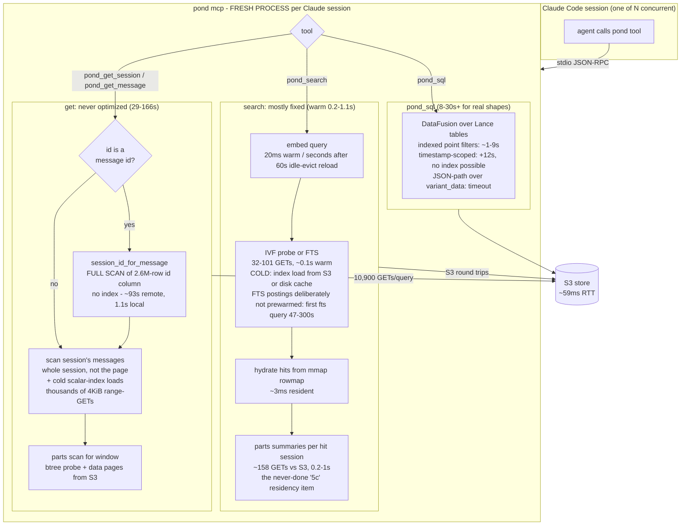
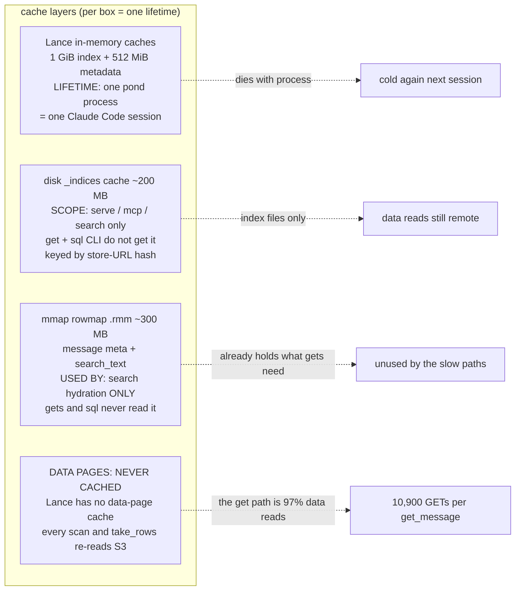

# Read path: where the time actually goes (measured, 2026-08-12)

Store: `s3+https://nbg1.your-objectstorage.com/pondarium/pond` (Hetzner, ~59ms RTT). Corpus: 14,304 sessions / 2.64M messages. pond 0.14.6 via `pond mcp` (stdio, one process per Claude Code session), launchd sync every 5 min (each run takes 2-2.5 min).

Every number in this document is measured, not estimated. Sources: (a) 30 days of observed end-to-end MCP tool latencies mined from the corpus itself (2,281 calls, 2026-07-13..08-12); (b) `serve_mem_bench --io-trace` per-component S3 GET attribution on the live store; (c) cold CLI probes against the live store vs the local store (2026-08-12); (d) session archaeology across the June/July perf investigations.

## 1. The verdict in one table

30-day end-to-end latency of every pond MCP call (from tool_call/tool_result timestamps stored in the corpus):

| tool | n | p50 | p90 | calls <= 5s |
|---|---|---|---|---|
| pond_get_message | 90 | 84s | 205s | **0** |
| pond_get (legacy) | 537 | 40s | 146s | 26 (36 censored at the 300s client timeout) |
| pond_get_session | 64 | 29s | 72s | **0** |
| pond_sql | 192 | 23s | 82s | 33 |
| pond_sql_query (legacy) | 895 | 10s | 34s | 289 |
| pond_search | 466 | 10s | 61s | 154 |
| all | 2281 | **17s** | **92s** | 23% |

77% of all pond MCP calls exceed 5s. The get family is the disaster: **not one `pond_get_session` or `pond_get_message` call finished under 5s in 30 days**. Weekly trend is flat-to-worse across the window; none of the July perf work moved these numbers.

Why the perf work did not show up here: PR #79 made the *warm search arms* fast (0.2-1.1s server-side, re-confirmed below) and #100 made *indexed* SQL shapes possible, but (1) the get path was never touched, (2) most calls land on cold or short-lived processes where the warm state does not exist, and (3) the store grew 23% while sync churn doubled version turnover.

## 2. Direct probes (2026-08-12, live store)

Cold one-shot CLI (the same lifecycle as a fresh `pond mcp` answering its first call), twice each, vs the identical calls on the local store:

| probe | remote run1 | remote run2 | local |
|---|---|---|---|
| `get-session` by session id | 74.1s | 72.7s | 0.7s |
| `get-session` by message id | 166.1s | 165.9s | 1.1s |
| `get-message` | 153.0s | 158.7s | 0.7s |

The probe session has **25 messages and 7 parts**. 73 seconds to page a 25-message session; 100-200x the local time for identical work. run2 == run1: repeat reads buy nothing (Section 4).

The message-id variants add ~93s over the session-id variant. That is the message-id -> session resolution: `messages.id` has no index (the btree was removed in the post-overhaul cleanup as "rare full-scan" - before the MCP tool redesign made message-id resolution the standard flow after every search), so every resolution is a full scan of the 2.6M-row `id` column from S3. Locally the same full scan is 1.1s.

S3 request attribution per WARM query (`cargo bench --bench serve_mem_bench --features io-trace -- --storage-path <store> --io-trace`):

| component | GETs p50 | bytes p50 | note |
|---|---|---|---|
| scope_count | 0 | 0 | answered from FTS num_docs (resident) |
| fts_search | 32 | 296 KiB | index-resident probe |
| vector_search | 101 | 2.8 MiB | IVF probe, nprobes-bounded |
| pond_search (full) | 291 | 5.3 MiB | arms + hydration (~158 GETs = parts summaries + session lookups) |
| **pond_get_message** | **10,900** | **42 MiB** | ~4 KiB average per request, 97% on table DATA files |

One warm `pond_get_message` issues **35x more S3 requests than an entire search pipeline**. The request breakdown shows 217,481 of 224,000 total get requests over 20 queries hitting data files (not indexes): this is column data being dragged through tiny scattered range-reads, which on an object store is pure round-trip queueing. Eight of these in parallel (the observed subagent fan-out on 2026-07-15) is ~87,000 queued requests through one process's S3 client: every call in that window hit the 300s client timeout. The rmcp server dispatches requests concurrently (verified: it spawns a task per request), so this is IO-queue collapse, not handler serialization.

## 3. What a read actually does (and where it bleeds)



The three surfaces are in three different states:

1. **search** was genuinely fixed for the warm case (#79) and its remaining warm cost is the parts-summary hydration (5c, never done). Its observed p50 of 10s is cold-process overhead, not the arms: process spawn, index load, model load after the 60s idle eviction, plus queueing behind syncs.
2. **get** was never optimized. It still does filtered scans as if the store were local: message-id resolution full-scans an unindexed column, the session view scans the whole session to serve one page, and none of it touches the rowmap that search hydration already has resident. Every observed get >= 5s, p50 29-84s.
3. **sql** is fixed only for the shapes the materialized columns cover (#100). Timestamp scoping (+12s, index blocked upstream by the tz-coercion defect) and any JSON-path predicate over `variant_data` remain 10s..timeout.

## 4. The cache truth: what is warm, what can never be warm



Answering the direct question - "why are we not utilizing all the in-memory cache we have efficiently":

1. **The slow path reads the one thing no cache covers.** io-trace shows warm get traffic is 97% data-file reads. Lance's caches hold indexes and metadata; there is no data-page cache at any layer. So a get is exactly as expensive the 100th time as the 1st (probe run2 == run1).
2. **The in-memory cache lifetime is one Claude Code session.** MCP is registered as `pond mcp` over stdio, so each session spawns a fresh process; the 1 GiB index cache and the loaded E5 model die with it. Only the disk `_indices` cache and the rowmap survive, and gets use neither.
3. **The rowmap - the purpose-built resident cache - is only wired into search hydration.** It already holds, mmap'd and dictionary-encoded, every message's id, session_id, role, timestamp, project, source_agent and search_text, plus per-session aggregates. Everything `get_session`'s conversational page and the message-id resolution need is sitting resident in it, unused.
4. **The embedder idle-evicts after 60s.** Agent tool calls arrive minutes apart, so nearly every vector search in a real session re-pays the ~790 MB model load. Correct for RAM, invisible in steady-state benches, real seconds per call in practice.
5. **Sync churn invalidates what little survives.** A sync every 5 min (running 2-2.5 min each) bumps the manifest version, mints new index deltas (disk-cache misses), and competes for the same uplink while reads run.

## 5. Root causes ranked by user-facing seconds

| # | cause | cost, measured | surface |
|---|---|---|---|
| 1 | `messages.id` unindexed; message-id resolution full-scans 2.6M rows from S3 | ~93s/call cold, the bulk of the warm 10,900-GET storm | get_session(message-id), get_message - the standard post-search flow |
| 2 | get path bypasses the rowmap; whole-session scans + cold scalar-index loads via thousands of ~4 KiB range-GETs | 73s cold for a 25-message session; zero gets under 5s in 30 days | both gets |
| 3 | concurrent fan-out multiplies #1/#2 through one S3 client | 8 parallel trivial gets -> all hit 300s timeout | subagent swarms |
| 4 | cold process per Claude session + FTS postings never prewarmed + 60s embedder eviction | first fts query 47-300s; search p50 10s vs 0.2-1.1s warm | search |
| 5 | parts-summary hydration scans S3 per hit session (the never-done 5c) | 0.2-1s per warm search, more cold | search, gets |
| 6 | SQL: no timestamp index (upstream tz bug), JSON-path predicates full-scan `variant_data` | +12s any date-scoped query; timeouts on JSON paths | pond_sql |
| 7 | sync every 5 min churns versions/index deltas and shares the uplink | background tax on everything | all |

## 6. What would buy the seconds back (proposal, not yet implemented)

Ordered by seconds-recovered per unit of work:

1. **Resolve message ids from the rowmap.** The rowmap already stores every message_id with its session. An id -> session/row lookup table over the existing mmap (or simply re-adding a `messages.id` btree, accepting its sync-time ExternalSort cost) removes ~93s from every by-message-id get. Expected: message-id resolution ~0ms resident.
2. **Serve `get_session` conversational pages from the rowmap.** Page selection needs (id, role, timestamp, search_text) per message of one session - all resident today. Only the parts summaries would still touch S3, and per-message take_rows can backfill rowmap misses. Expected: get_session 73s -> parts-scan cost only (~1-2s), and further with 5c.
3. **Finish 5c: parts summaries resident** (or served from a compact parts-meta sidecar next to the rowmap). Kills the last per-hit S3 scan in search AND the parts leg of gets.
4. **One long-lived server instead of N cold processes.** `pond serve` already mounts MCP on the `/mcp` HTTP route, and `--with-sync` folds the sync into the same process. Registering Claude Code against the HTTP endpoint instead of stdio makes all sessions share one warm cache, one model, one S3 client - and removes the per-session cold start entirely. This is a config-level topology change, no new code.
5. **Give the get/sql CLI paths the disk index cache** (currently scoped to serve/mcp/search) so cold scalar-index loads read local disk.
6. **Bound concurrent expensive reads per process** (small semaphore around the scan-heavy handlers) so a subagent swarm degrades to queueing at ~10-70s instead of collapsing to 300s timeouts.
7. **Prewarm FTS postings from the disk cache** (bounded), so the first fts-arm query in a process is not a 47-300s cold load.

Regression guards already in place for the fix work: `serve_mem_bench --io-trace` (GET counts per component - the get storm must drop from ~10,900 to tens), `read_bench` (tail-scan latency), and the cold CLI probe pair from Section 2 (session-id vs message-id delta must collapse from ~93s to ~0).

## 7. Reproduction commands

```
cargo bench --bench serve_mem_bench --features io-trace -- --storage-path 's3+https://nbg1.your-objectstorage.com/pondarium/pond' --io-trace
cargo bench --bench serve_mem_bench --features io-trace -- --storage-path '<store>' --attribute
pond get-session <session-id>        # cold probe, time it
pond get-session <message-id>        # adds the id-column full scan
pond get-message <message-id>
```

30-day latency mining: join `parts` tool_call/tool_result rows on (session_id, call_id) via `pond_sql`, diff the containing messages' timestamps, filter `tool_name LIKE '%pond%'`.
